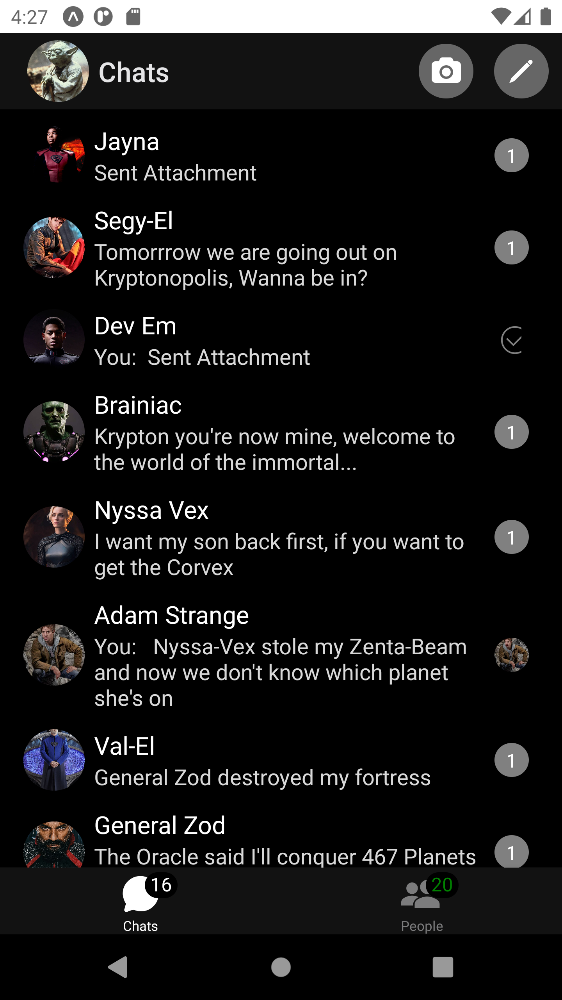
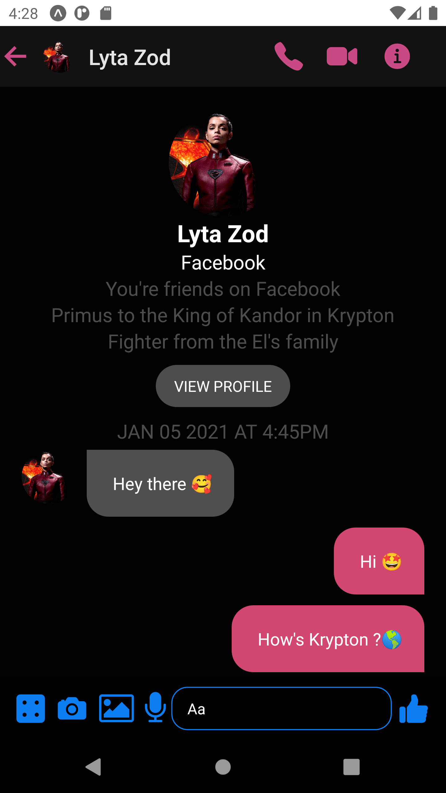
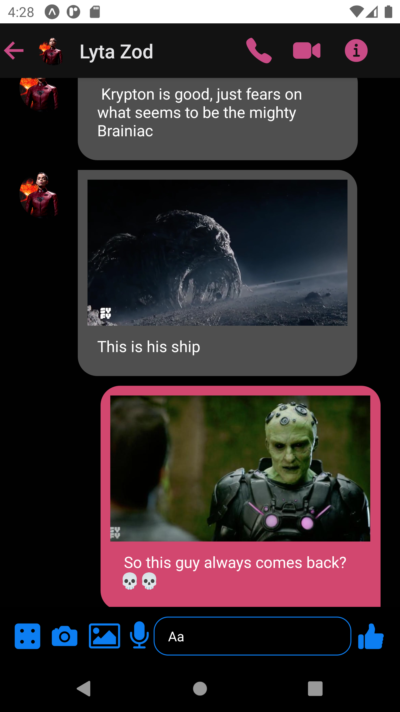
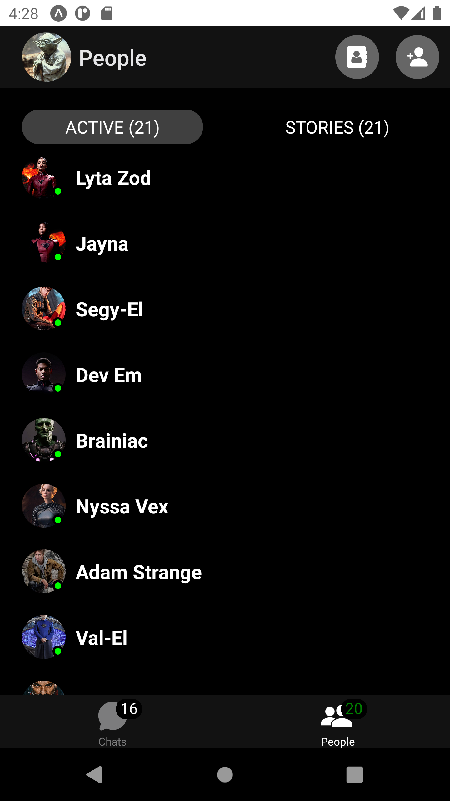
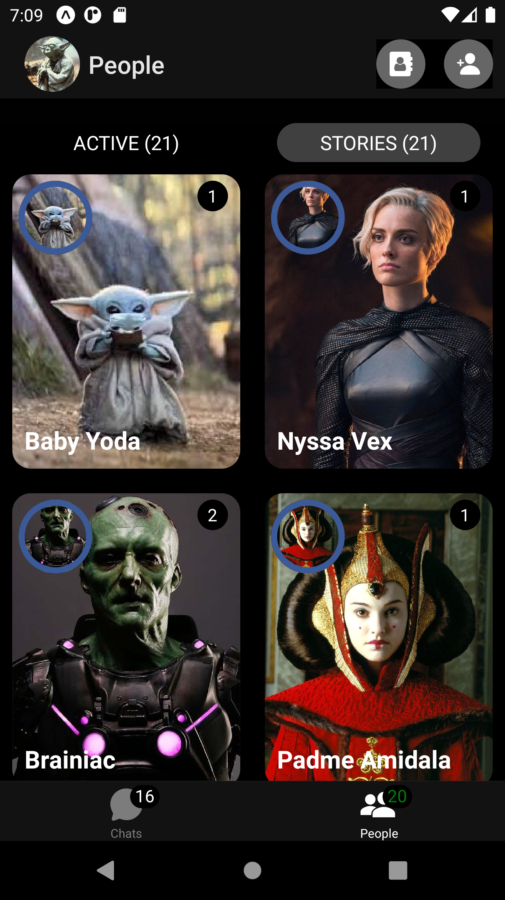
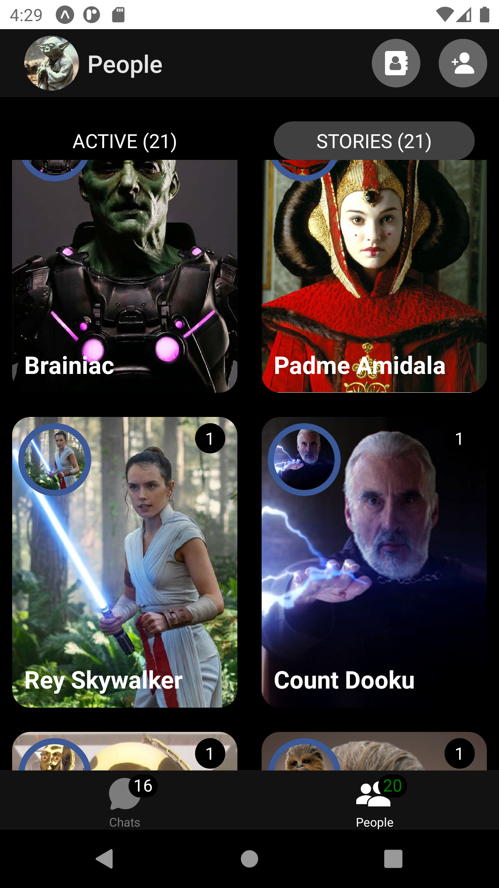

# React Native Facebook Messenger Clone

An exact Facebook Messenger UI as at the day of this push.
A Beautiful Chat Messenging UI developed in React Native

## ✨ Requirements

- Any Operating System (ie. MacOS X, Linux, Windows)
- Nodejs and Expo CLI installed
- yarn (Optional)
- Your prefered IDE, VS Code was used for this project

## 🖥️ Running

> 1. Clone the repo to your local & Give me a star 😎🌟
> 2. On the project root, run `expo install` to install the dependencies
> 3. Open your emulator, or download expo app on your physical device
> 4. Run `npm start` or `yarn android` to start the expo server, if you're using React Native CLI, run `react-native run-ios` for iOS and `react-native run-android` for Android
> 5. If using a physical device, scan the QR Code on your CLI to compile the code
> 6. 👏👏👏 That's it 👏👏👏

## 📸 ScreenShots

  

 

 

## 🤓 Author(s)

**Simoniel Musyoki**

## ✋ Disclaimer !!!

Images used in this app, come from Sci-Fi Series named **Krypton**, and **Star Wars**, I don't own them, they maybe subject to copyrights when being used in production
